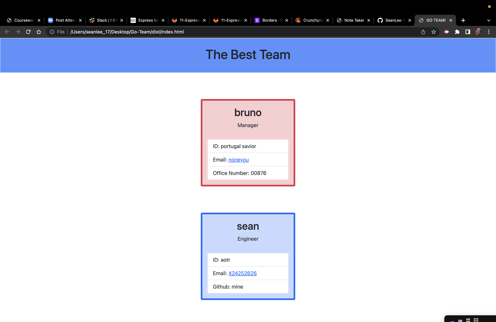

# Go-Team

## Description

In this team developer, the user can form a team of interns, engineers, and managers through a single program. This is done entirely through JavaScript. I also used Inquirer and Jest to help code this monstrosity. This project we also had to test our function thanks to the "npm run test" command in our integrated terminals.

## Table of Contents

- [Usage](#usage)

- [Contributing](#contributing)

- [Tests](#tests)

- [Questions](#questions)

- [Links](#links)

## "Like the ceiling can't hold us" -Ray Dalton

You can use this to create a team of employees in seconds. Simply type "node index.js" into your terminal and answer the prompts that pop up in the terminal. You can add any amount of interns and engineers to your team while you are only limited to one manager at this time. Once you are done with your team, simply select "Nah" and the program will generate a custom HTML page for the user.

## Contributing

Me and Mike popping off during office hours

## Test

There is a test folder in this program already set up for the user. Just type "npm run test" to test this code yourself

## Questions

Github Username: Sean-Lee-17

## Links 

- [Github](https://github.com/SeanLee-17/Go-Team)
- [Live Website](https://seanlee-17.github.io/Go-Team/)

## Screenshot

